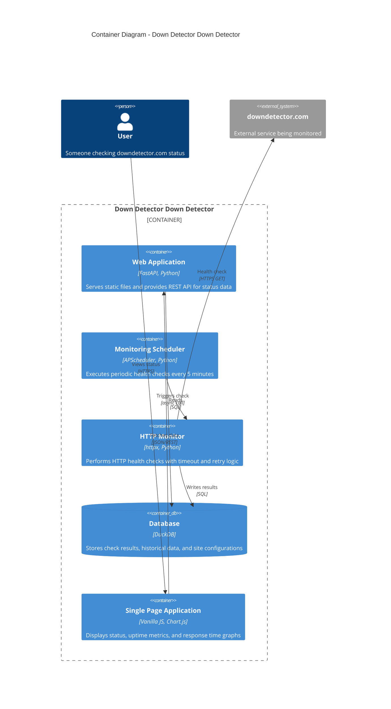

# Container Diagram

This diagram shows the high-level technology choices and how containers within the Down Detector Down Detector system communicate.

## C4 Container Level



## Container Descriptions

### Web Application (FastAPI)
- **Technology**: FastAPI with Uvicorn ASGI server
- **Purpose**: Serves static frontend files and provides REST API endpoints
- **Port**: 8000 (default)
- **Key Features**:
  - Automatic OpenAPI documentation
  - Async request handling
  - CORS support for frontend
  - Read-only database access

**API Endpoints**:
```
GET /api/status         # Current status
GET /api/uptime         # Uptime statistics
GET /api/checks         # Recent check history
GET /api/response-times # Response time data for charts
```

### Monitoring Scheduler (APScheduler)
- **Technology**: APScheduler with AsyncIO executor
- **Purpose**: Orchestrates periodic health checks
- **Schedule**: Every 5 minutes (300 seconds)
- **Key Features**:
  - Async task execution
  - Error handling and logging
  - Graceful shutdown
  - Configuration-driven site list

### HTTP Monitor (httpx)
- **Technology**: httpx async HTTP client
- **Purpose**: Executes HTTP health checks with resilience
- **Key Features**:
  - 30-second timeout
  - Exponential backoff on failures
  - Retry-After header respect
  - Response time measurement
  - Connection pooling

### Database (DuckDB)
- **Technology**: DuckDB embedded OLAP database
- **Purpose**: Stores all monitoring data
- **File Location**: `data/monitoring.duckdb`
- **Key Features**:
  - Embedded (no server process)
  - Columnar storage for analytics
  - Efficient aggregations
  - SQL interface

**Schema**:
```sql
sites (
  id, name, url, monitor_type, check_interval, enabled
)

checks (
  id, site_id, timestamp, status, response_time_ms, http_code, error_message
)
```

### Single Page Application (Vanilla JS)
- **Technology**: Vanilla JavaScript with Chart.js
- **Purpose**: User interface for viewing status and metrics
- **Key Features**:
  - No build step required
  - Chart.js for response time graphs
  - Auto-refresh every 30 seconds
  - Minimal dependencies

## Data Flow

### Monitoring Flow
```
Scheduler (every 5min)
  → Monitor.check_health()
    → HTTP GET to downdetector.com
    → Measure response time
    → Parse status code
  → Write result to Database
```

### User Request Flow
```
User
  → Frontend SPA
    → API Request (GET /api/status)
      → Web App
        → Query Database
        → Return JSON
      ← Response
    ← Render UI
```

## Deployment

Both containers run as separate Python processes:

```bash
# Process 1: Monitoring Scheduler (background)
python -m src.scheduler

# Process 2: Web Application (foreground)
python -m src.api
```

Shared resource:
- Both processes access the same DuckDB file
- Scheduler: Read/Write access
- Web App: Read-only access

## Scalability Considerations

Current design is optimized for:
- Single machine deployment
- Personal use (low traffic)
- 5-minute check interval

Future enhancements could include:
- Docker Compose orchestration
- Separate database for high-traffic scenarios
- Multiple monitor processes for different sites
