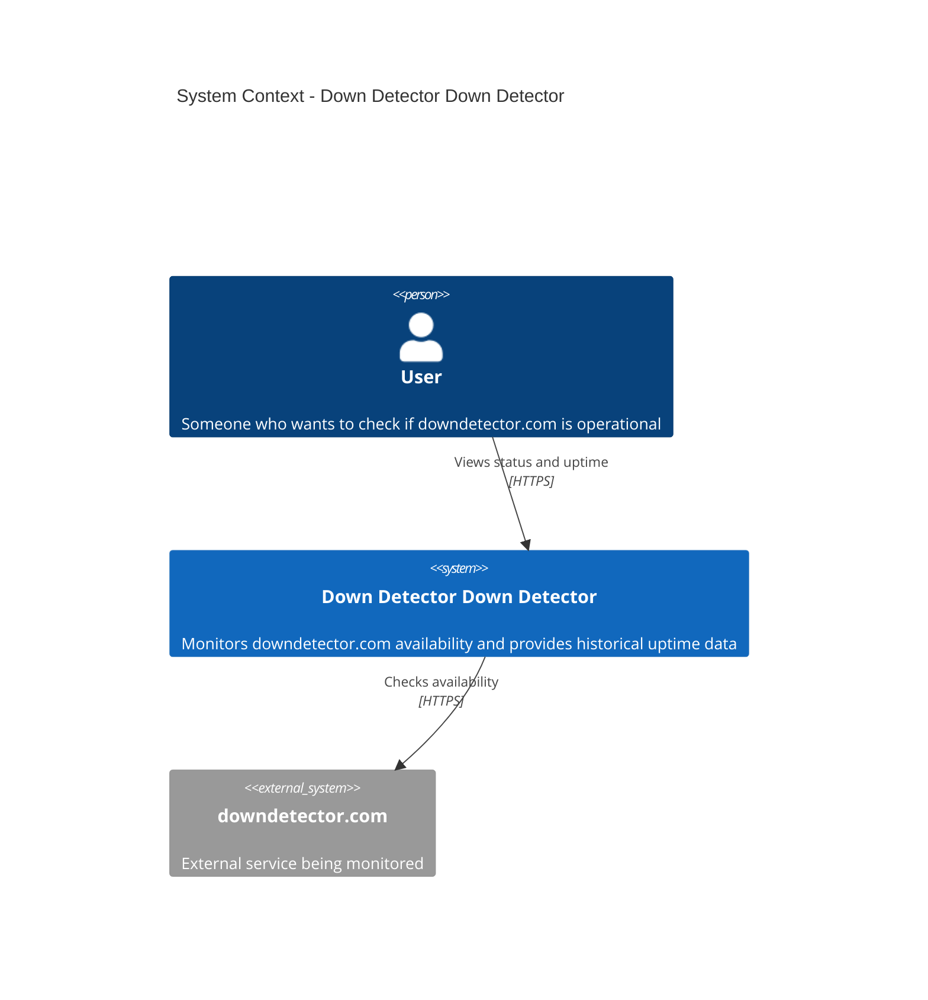

# System Context Diagram

This diagram shows the Down Detector Down Detector system and its relationships with users and external systems.

## C4 Context Level

## System Description

### Down Detector Down Detector
A self-hosted monitoring service that tracks the availability and performance of downdetector.com. It provides:
- Real-time status information
- Historical uptime statistics
- Response time tracking
- Incident history

### Users
- **Primary**: The site owner (personal use)
- **Potential**: Anyone with access to the self-hosted instance

### External Systems
- **downdetector.com**: The target system being monitored
  - HTTP health checks every 5 minutes
  - Response time measurements
  - Status code validation

## Key Interactions

1. **User → System**: User accesses the web interface to view current status and historical data
2. **System → downdetector.com**: Automated health checks sent every 5 minutes via HTTP GET requests
3. **System → User**: Real-time status updates and historical analytics displayed in the UI

## Boundaries

- **In Scope**: Monitoring, data storage, status display
- **Out of Scope**: Notifications, alerting, multi-region checks (initially)
